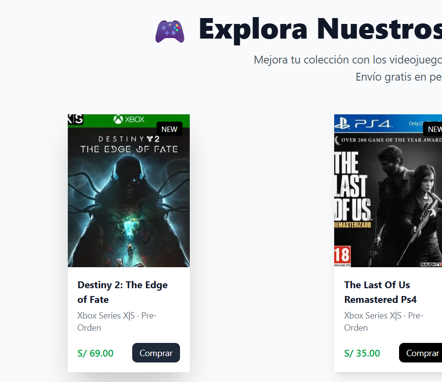
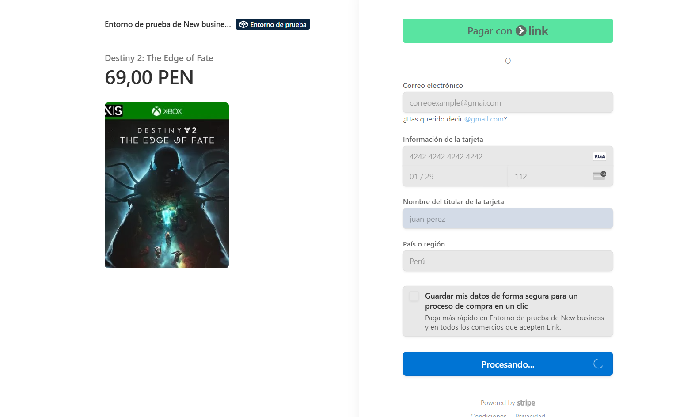
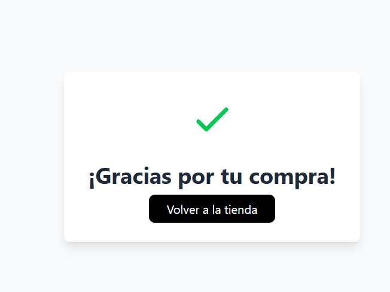

# Stripe Pasarela - Integracion simple de Stripe con Nuxt.Js

[🔗 Ir a la demo en vivo](https://stripe-simple-payment-4jqz.vercel.app/)


<!-- <table>
  
  <tr>
    <td></td>
    <td></td>
    <td></td>
  </tr>
</table>  -->

##  Datos de Prueba Stripe

Para probar la pasarela de pagos, usa estas tarjetas de prueba:

| Caso de Prueba       | Número de Tarjeta       | Comportamiento               |
|----------------------|-------------------------|------------------------------|
| Pago exitoso         | `4242 4242 4242 4242`   | Transacción aprobada         |


**Datos adicionales:**
- Fecha de expiración: Cualquier fecha futura (ej: 12/30)
- CVC: Cualquier código de 3 dígitos (ej: 123)


Stripe Pasarela es una aplicación web desarrollada con Nuxt.js que permite integrar de manera sencilla y eficiente la pasarela de pagos de Stripe en tus proyectos. Esta aplicación proporciona una interfaz intuitiva para gestionar pagos, suscripciones y transacciones, facilitando la implementación de soluciones de comercio electrónico.

## Tecnologías
- **Nuxt.js**: Framework de Vue.js para crear aplicaciones web universales.
- **Stripe API**: Plataforma de pagos que permite realizar transacciones seguras en línea.
- **Vue.js**: Biblioteca de JavaScript para construir interfaces de usuario. 
- **Tailwind CSS**: Framework de CSS para diseñar interfaces modernas y responsivas.
## Instalación y Uso
Para instalar y utilizar Stripe Pasarela, sigue estos pasos:
1. Clona el repositorio:
   ```bash
   git clone https://github.com/Robzm/stripe-simple-payment.git
   cd stripe-simple-payment
    ```
2. Instala las dependencias:
   ```bash
   npm install
   ```
   o
   ```bash
   yarn install
   ```
3. Configura tus credenciales de Stripe:
   Crea un archivo `.env` en la raíz del proyecto y añade tus claves de API de Stripe:
   ```env
   STRIPE_PUBLIC_KEY=tu_clave_publica
   STRIPE_SECRET_KEY=tu_clave_secreta
   ```
4. Inicia el servidor de desarrollo:
   ```bash
   npm run dev
   ```
   o
   ```bash
   yarn dev
   ```
5. Abre tu navegador y accede a `http://localhost:3000` para ver la aplicación en funcionamiento.


Check out the [deployment documentation](https://nuxt.com/docs/getting-started/deployment) for more information.
